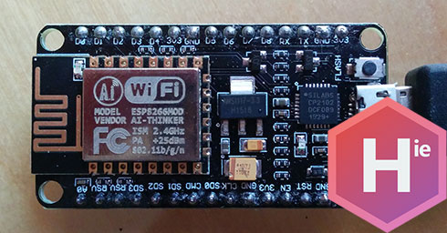

Homie for ESP8266
=================



An Arduino for ESP8266 implementation of [Homie](https://git.io/homieiot), an MQTT convention for the IoT.

## Features

* Automatic connection/reconnection to Wi-Fi/MQTT
* [Cute JSON configuration file](docs/5.-JSON-configuration-file.md) to configure the credentials of the device
* [Cute API / Web UI / App](docs/6.-Configuration-API.md) to remotely send the configuration to the device and get information about it
* [OTA support](docs/4.-OTA.md)
* Available in the [PlatformIO registry](http://platformio.org/#!/lib/show/555/Homie)
* Pretty straightforward sketches, a simple light for example:

```c++
#include <Homie.h>

const int PIN_RELAY = 5;

HomieNode lightNode("light", "switch");

bool lightOnHandler(String value) {
  if (value == "true") {
    digitalWrite(PIN_RELAY, HIGH);
    Homie.setNodeProperty(lightNode, "on", "true"); // Update the state of the light
    Serial.println("Light is on");
  } else if (value == "false") {
    digitalWrite(PIN_RELAY, LOW);
    Homie.setNodeProperty(lightNode, "on", "false");
    Serial.println("Light is off");
  } else {
    return false;
  }

  return true;
}

void setup() {
  pinMode(PIN_RELAY, OUTPUT);
  digitalWrite(PIN_RELAY, LOW);

  Homie.setFirmware("awesome-relay", "1.0.0");
  lightNode.subscribe("on", lightOnHandler);
  Homie.registerNode(lightNode);
  Homie.setup();
}

void loop() {
  Homie.loop();
}
```

## Requirements, installation and usage

The project is documented on the [/docs folder](docs), with a *Getting started* guide and every piece of informations you will need.
